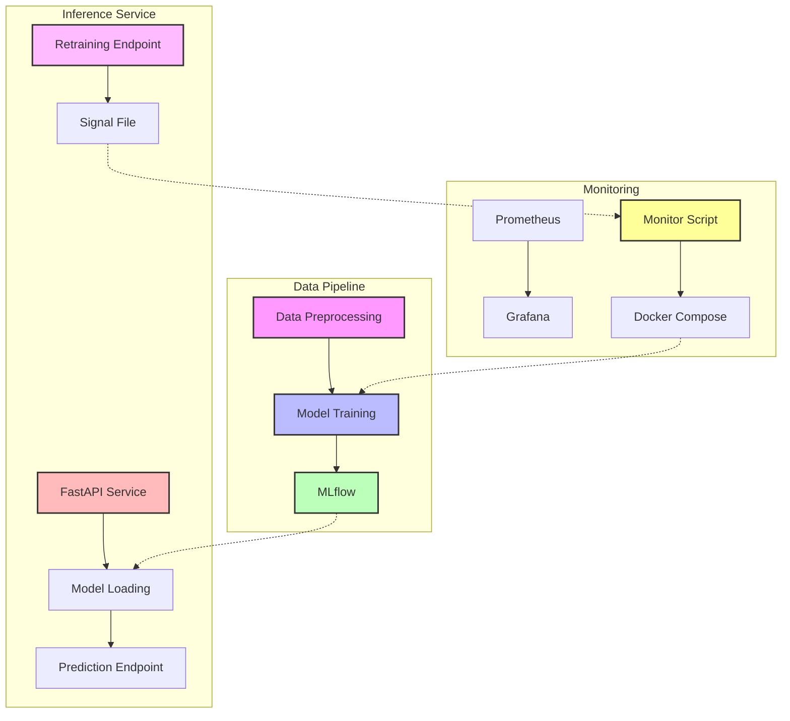
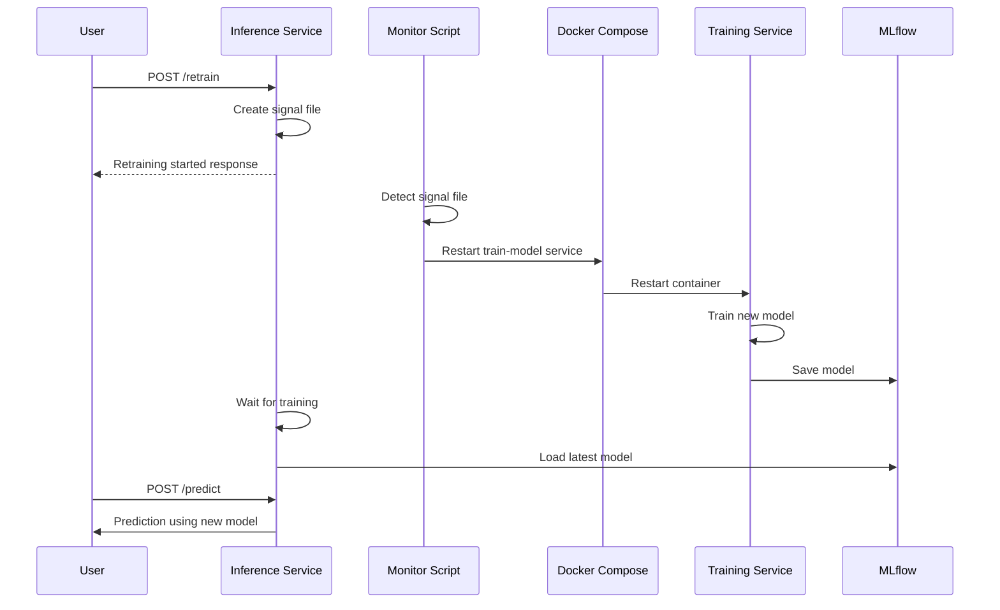

# End-to-End MLOps Tutorial with ZenML and Docker

This tutorial guides you through setting up and running a complete MLOps pipeline using ZenML and Docker. The project is structured following best practices, with clear separation of concerns and modular components.

## Architecture Overview



### Components

1. **Data Pipeline**
   - **Data Preprocessing**: Loads and preprocesses the Iris dataset
   - **Model Training**: Trains a RandomForest model and logs to MLflow
   - **MLflow**: Tracks experiments, metrics, and stores models

2. **Inference Service**
   - **FastAPI Service**: Provides REST API endpoints
   - **Model Loading**: Loads the latest model from MLflow
   - **Prediction Endpoint**: Serves model predictions
   - **Retraining Endpoint**: Triggers model retraining

3. **Monitoring**
   - **Prometheus**: Collects metrics from the inference service
   - **Grafana**: Visualizes metrics and creates dashboards
   - **Monitor Script**: Watches for retraining signals
   - **Docker Compose**: Orchestrates service restarts for retraining

### Retraining Flow



## Project Structure

```
zenml_mlops_template/
├── config/                    # Configuration files
│   └── prometheus.yml         # Prometheus monitoring configuration
├── data-file/                 # Data directory
│   └── iris_preprocessed.csv  # Preprocessed data
├── dockerfiles/               # Dockerfiles for each service
│   ├── Dockerfile.inference   # Dockerfile for the inference service
│   ├── Dockerfile.monitor     # Dockerfile for the retraining monitor
│   ├── Dockerfile.preprocess  # Dockerfile for data preprocessing
│   └── Dockerfile.train       # Dockerfile for model training
├── src/                       # Source code
│   ├── pipeline/              # Pipeline components
│   │   ├── __init__.py
│   │   ├── data_preprocess.py # Data preprocessing script
│   │   └── train_model.py     # Model training script
│   └── services/              # Service components
│       ├── __init__.py
│       ├── inference/         # Inference service
│       │   ├── __init__.py
│       │   └── inference_service.py # FastAPI inference service
│       └── monitor/           # Monitor service
│           ├── __init__.py
│           ├── monitor_service.py # Retraining monitor service
│           └── run_monitor.py # Entry point for monitor service
├── docker-compose.yml         # Docker Compose configuration
└── run_pipeline.py            # ZenML pipeline runner
```

## Prerequisites

- Docker and Docker Compose installed
- Python 3.8+ installed
- Basic understanding of machine learning concepts

## Setup and Launch

### 1. Clone the Repository

```bash
git clone https://github.com/yourusername/zenml_mlops_template.git
cd zenml_mlops_template
```

### 2. Start the Services

```bash
# Build and start all services (including the retraining monitor)
docker-compose up -d

# Check that all services are running
docker-compose ps
```

### 3. Test the Pipeline

```bash
# Check the health of the inference service
curl http://localhost:8000/health

# Make a prediction
curl -X POST -H "Content-Type: application/json" -d '{"sepal_length": 5.1, "sepal_width": 3.5, "petal_length": 1.4, "petal_width": 0.2}' http://localhost:8000/predict

# Trigger model retraining
curl -X POST http://localhost:8000/retrain
```

## Service Endpoints

| Service | URL | Description |
|---------|-----|-------------|
| Inference API | http://localhost:8000 | FastAPI service for predictions |
| MLflow | http://localhost:5001 | MLflow UI for experiment tracking |
| Prometheus | http://localhost:9090 | Prometheus UI for metrics |
| Grafana | http://localhost:3000 | Grafana for visualization |
| ZenML | http://localhost:8888 | ZenML Dashboard |

## Model Retraining

The MLOps pipeline supports two methods for model retraining:

### Option 1: Using Docker Compose

To retrain the model using Docker Compose, run:

```bash
# Restart just the training service
docker-compose restart train-model

# Or run it specifically
docker-compose up train-model
```

### Option 2: Using the API Endpoint

The inference service provides an API endpoint for triggering retraining:

```bash
# Trigger retraining via API
curl -X POST http://localhost:8000/retrain

# The response will indicate that retraining has started
# {"status":"retraining_started","message":"Model retraining has been started in the background. The new model will be used for predictions once training is complete."}
```

When you use the API endpoint, the following happens:
1. The inference service creates a signal file in the data-file directory
2. The monitor script detects the signal file and restarts the train-model service
3. The train-model service retrains the model and saves it to MLflow
4. After waiting for the training to complete, the inference service loads the new model
5. All future predictions use the newly trained model

You can verify the model status using the health endpoint:

```bash
curl http://localhost:8000/health
```

## Current Project Status

### Authentication with ZenML

The project is currently facing authentication challenges with ZenML 0.75.0. Here's the current status:

1. **Authentication Approach**: 
   - Using direct username/password authentication with the ZenML server
   - Environment variables are set in docker-compose.yml for authentication:
     ```yaml
     - ZENML_SERVER_URL=http://zenml:8080
     - ZENML_STORE_URL=http://zenml:8080
     - ZENML_DEFAULT_USERNAME=admin
     - ZENML_DEFAULT_PASSWORD=P@ssword123$
     - ZENML_AUTO_ACCEPT_PROMPTS=true
     ```

2. **Current Issues**:
   - Authentication with ZenML server fails in the train-model service
   - The ZenML CLI login command syntax has changed in version 0.75.0
   - The Python client authentication flow needs to be updated

3. **Attempted Solutions**:
   - Updated run_pipeline.py to use explicit login with ZenML CLI
   - Modified the stack setup to use the Python client directly
   - Simplified the authentication flow in docker-compose.yml

### Next Steps

To resolve the authentication issues, the following steps are recommended:

1. **Check ZenML Documentation**:
   - Review the latest ZenML 0.75.0 documentation for authentication changes
   - Verify the correct CLI login command syntax

2. **Update Authentication Approach**:
   - Consider using a service account with an API key for non-interactive workloads
   - Update the run_pipeline.py file with the correct authentication flow

3. **Test Authentication Separately**:
   - Create a simple script to test ZenML authentication in isolation
   - Verify that the authentication works before integrating with the pipeline

4. **Alternative Approaches**:
   - Consider using environment variables directly for authentication
   - Explore using a configuration file for authentication

## Monitoring and Retraining

Despite the authentication challenges, the monitoring and retraining architecture is fully implemented:

1. The monitor service is containerized and runs as a dedicated service in Docker Compose
2. The retraining flow using signal files is implemented and ready to use
3. The inference service is configured to trigger retraining and load new models

Once the authentication issues are resolved, the full MLOps pipeline with automated retraining will be operational.

## ZenML API Key Authentication

The training service connects to the ZenML UI using API key authentication, which is the recommended approach for non-interactive environments like Docker containers in ZenML 0.75.0.

### Setting Up ZenML API Key

1. Make sure you have ZenML CLI installed:
   ```bash
   pip install zenml==0.75.0
   ```

2. Run the provided setup script to create a service account and generate an API key:
   ```bash
   python setup_zenml_api_key.py
   ```
   
   This script will:
   - Create a ZenML service account named "training-service"
   - Generate an API key for this service account
   - Save the API key to a `.env` file for use with docker-compose

3. Start the services with the API key:
   ```bash
   docker-compose up -d
   ```

### Manual API Key Setup

If you prefer to set up the API key manually:

1. Create a service account and generate an API key:
   ```bash
   zenml service-account create training-service
   ```

2. Copy the generated API key and create a `.env` file with:
   ```
   ZENML_API_KEY=your_generated_api_key
   ```

3. Start the services:
   ```bash
   docker-compose up -d
   ```

### How It Works

- The `docker-compose.yml` file is configured to pass the API key to the training service
- The training service uses this API key to authenticate with the ZenML server
- This enables the training pipeline to register and track experiments in the ZenML UI
- You can view pipeline runs, experiments, and artifacts in the ZenML UI at http://localhost:8080

## Troubleshooting

If you encounter authentication issues with ZenML, try the following:

1. Verify that the ZenML server is running:
   ```bash
   docker-compose ps zenml
   ```

2. Check the ZenML server logs:
   ```bash
   docker-compose logs zenml
   ```

3. Try connecting to the ZenML server manually:
   ```bash
   docker exec -it zenml_mlops_template-train-model-1 bash
   zenml login --server http://zenml:8080
   ```

4. Verify the environment variables in the container:
   ```bash
   docker exec -it zenml_mlops_template-train-model-1 env | grep ZENML
   ```

## Resources

- [ZenML Documentation](https://docs.zenml.io/)
- [ZenML Authentication Guide](https://docs.zenml.io/how-to/project-setup-and-management/connecting-to-zenml)
- [MLflow Documentation](https://mlflow.org/docs/latest/index.html)

## 1. Setting Up Your Environment

### Create and Activate a Virtual Environment

```bash
# Create the virtual environment
python -m venv .venv

# Activate the virtual environment
# On macOS/Linux:
source .venv/bin/activate
# On Windows:
.venv\Scripts\activate
```

### Install ZenML and Required Integrations

```bash
pip install zenml
zenml integration install sklearn mlflow
```

## 2. Running the Dockerized ZenML Server

The `docker-compose.yml` file defines all the services required for our MLOps pipeline, including:
- ZenML server with MySQL as the metadata store
- MLflow tracking server for experiment tracking (using the official MLflow image)
- Data preprocessing service
- Model training service
- FastAPI inference service
- Prometheus for monitoring
- Grafana for dashboards

Start the ZenML server and related services:

```bash
docker-compose up -d zenml mysql mlflow
```

This will start the ZenML server, MySQL database, and MLflow tracking server in detached mode.

Verify that the ZenML server is running by navigating to http://localhost:8888 in your browser and logging in with:
- Username: admin
- Password: zenml

## 3. Configuring the ZenML Stack

With your virtual environment active, connect to the running ZenML server:

```bash
zenml connect --url http://localhost:8080 --username admin --password P@ssword123$
```

Initialize your ZenML repository:

```bash
zenml init
```

Register and set up your stack components:

```bash
# Register the local artifact store
zenml artifact-store register local_store --flavor=local --path=./zenml_artifacts

# Register the local Docker orchestrator
zenml orchestrator register local_docker_orchestrator --flavor=local_docker

# Register the MLflow experiment tracker
zenml experiment-tracker register mlflow_tracker --flavor=mlflow

# Register and set the stack
zenml stack register local_stack \
    -o local_docker_orchestrator \
    -a local_store \
    -e mlflow_tracker \
    --set
```

Verify your active stack:

```bash
zenml stack describe local_stack
```

## 4. Running the Pipeline

You can run the pipeline in two ways:

### Option 1: Using Docker Compose

This approach uses the Docker Compose setup to run each component as a separate service:

```bash
# Build and start all services
docker-compose up --build
```

This will:
1. Start the ZenML server and MySQL database
2. Run the data preprocessing service
3. Run the model training service
4. Start the inference API service
5. Start Prometheus and Grafana for monitoring

### Option 2: Using ZenML Pipeline Runner

This approach uses ZenML to orchestrate the pipeline:

```bash
# Run the ZenML pipeline
python run_pipeline.py
```

ZenML will:
1. Use the active stack (local_stack)
2. Build Docker containers for each step
3. Run each step in sequence
4. Save artifacts and log metrics

## 5. Testing the Inference API

Once the pipeline is complete and the inference service is running, you can test it:

```bash
curl -X POST -H "Content-Type: application/json" \
     -d '{"sepal_length": 5.1, "sepal_width": 3.5, "petal_length": 1.4, "petal_width": 0.2}' \
     http://localhost:8000/predict
```

You should receive a JSON response with the prediction result.

## 6. Monitoring and Metrics

Access the Prometheus UI to view metrics:

```
http://localhost:9090
```

Access the Grafana dashboard for visualization:

```
http://localhost:3000
```

## 7. Model Retraining

The MLOps pipeline supports two methods for model retraining:

### Option 1: Using Docker Compose

To retrain the model using Docker Compose, run:

```bash
# Restart just the training service
docker-compose restart train-model

# Or run it specifically
docker-compose up train-model
```

### Option 2: Using the API Endpoint

The inference service provides an API endpoint for triggering retraining:

```bash
# Trigger retraining via API
curl -X POST http://localhost:8000/retrain

# The response will indicate that retraining has started
# {"status":"retraining_started","message":"Model retraining has been started in the background. The new model will be used for predictions once training is complete."}
```

When you use the API endpoint, the inference service will:
1. Restart the train-model container using Docker Compose
2. Wait for the training to complete
3. Automatically load the new model from MLflow
4. Use the new model for future predictions

You can verify the model status using the health endpoint:

```bash
curl http://localhost:8000/health
```

## 8. Understanding the Components

### Data Preprocessing

The data preprocessing script (`src/pipeline/data_preprocess.py`) loads the Iris dataset and saves it as a CSV file for further processing.

### Model Training

The model training script (`src/pipeline/train_model.py`) loads the preprocessed data, trains a RandomForest classifier, and logs metrics and the model to MLflow.

### Inference Service

The FastAPI inference service (`src/services/inference/inference_service.py`) loads the trained model and exposes an endpoint for making predictions. It also includes Prometheus metrics for monitoring.

## 9. Customizing the Pipeline

To customize the pipeline for your own use case:

1. Modify the data preprocessing script to load and preprocess your own data
2. Update the model training script to use a different algorithm or hyperparameters
3. Adjust the inference service to handle your specific input and output formats
4. Update the Dockerfiles if you need additional dependencies

## 10. Troubleshooting

If you encounter issues:

1. Check container logs: `docker-compose logs <service-name>`
2. Verify that all services are running: `docker-compose ps`
3. Ensure data directories exist and have proper permissions
4. Check the health endpoint of the inference service: `curl http://localhost:8000/health`

## 11. Shutting Down

To stop all services:

```bash
# Stop all containers including the monitor
docker-compose down
```

To stop only specific services:

```bash
docker-compose stop <service-name>
```

## Conclusion

You now have a complete MLOps pipeline running locally with ZenML and Docker. This setup provides:

- Version control for ML pipelines
- Experiment tracking with MLflow
- Containerized execution of pipeline steps
- Model serving with FastAPI
- Monitoring with Prometheus and Grafana

This foundation can be extended to more complex use cases and eventually deployed to production environments.
