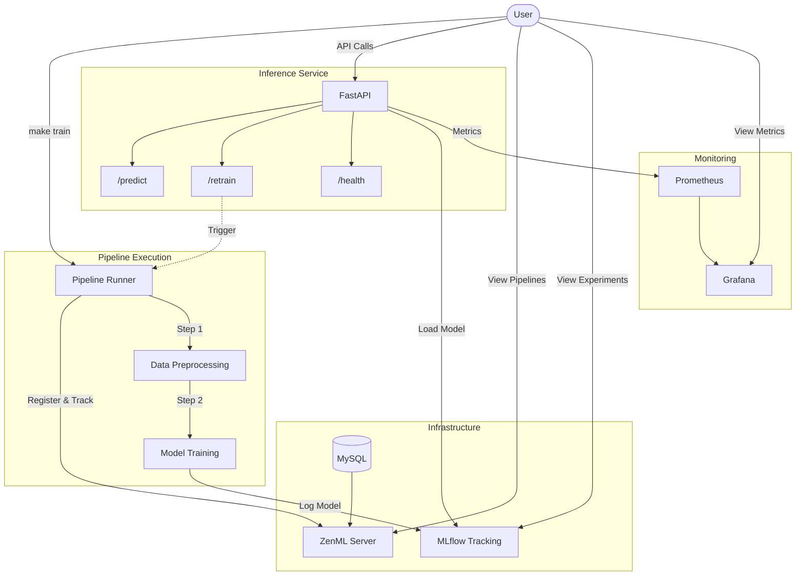
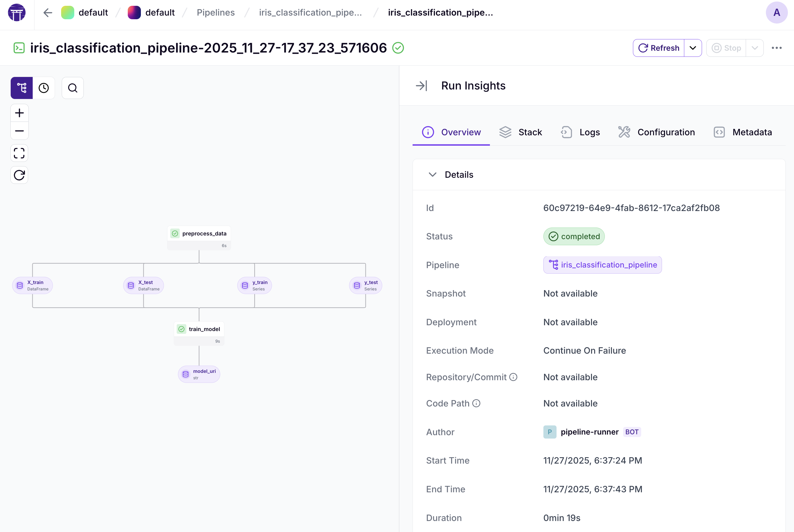
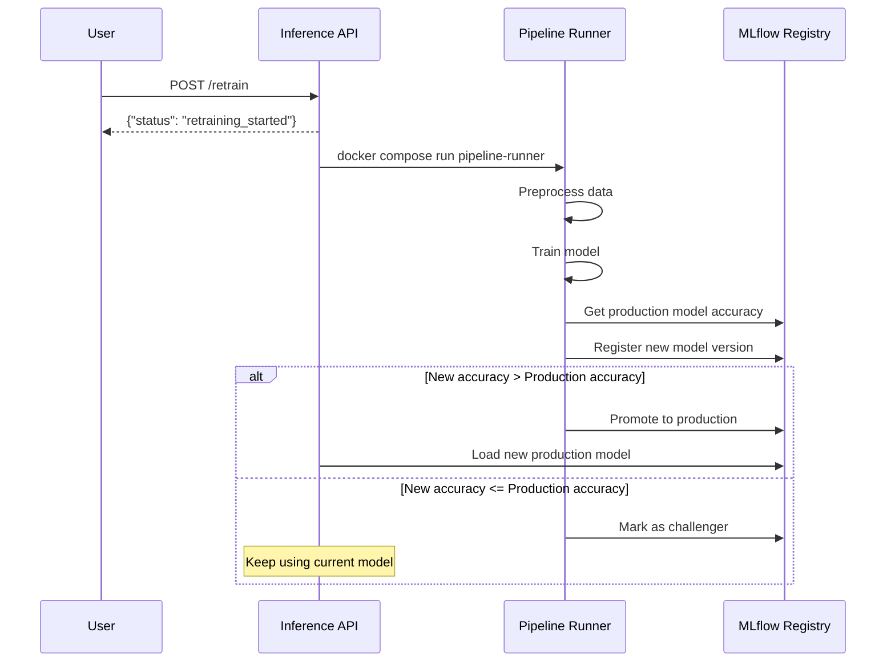

# ZenML MLOps Template

A complete MLOps pipeline using ZenML, MLflow, FastAPI, and Docker.

## Why ZenML?

While tools like **Airflow** and **Prefect** are excellent general-purpose workflow orchestrators, **ZenML** is purpose-built for ML pipelines:

| Feature | ZenML | Airflow/Prefect |
|---------|-------|-----------------|
| **ML-First Design** | Built specifically for ML workflows with native artifact tracking, model versioning, and experiment management | General-purpose DAG orchestration requiring custom integrations |
| **Artifact Lineage** | ✅ Automatic tracking of data, models, and metadata between pipeline steps (used in this project) | Manual implementation needed |
| **MLflow Integration** | Native integration with MLflow for experiment tracking and model registry | Requires custom operators/tasks |
| **Reproducibility** | Built-in versioning of pipelines, data, and models | Must be implemented manually |
| **Stack Abstraction** | Swap infrastructure (local → cloud) without code changes | Tied to specific infrastructure |
| **Minimal Boilerplate** | Simple `@step` and `@pipeline` decorators | More verbose DAG definitions |

### When to Use ZenML

- ✅ ML model training and deployment pipelines
- ✅ Experiment tracking and model versioning
- ✅ Team collaboration on ML projects
- ✅ Reproducible ML workflows

### When Airflow/Prefect Might Be Better

- ⚠️ Complex ETL workflows without ML components
- ⚠️ Existing Airflow/Prefect infrastructure investment
- ⚠️ Non-ML data engineering tasks

## Quick Start

```bash
# 1. Start all services
make up

# 2. Run the training pipeline (auto-creates service account)
make train

# 3. Make a prediction
make predict

# 4. Trigger retraining via API
make retrain
```

> **Note:** The pipeline-runner automatically creates a ZenML service account and API key on first run using the REST API. No manual setup required.

## Service URLs

| Service | URL | Credentials |
|---------|-----|-------------|
| ZenML Dashboard | http://localhost:8888 | admin / zenml |
| MLflow UI | http://localhost:5001 | - |
| Inference API | http://localhost:8000 | - |
| Prometheus | http://localhost:9092 | - |
| Grafana | http://localhost:3002 | admin / admin |

## Architecture



## Project Structure

```
zenml_mlops_template/
├── config/                         # Configuration files
│   └── prometheus.yml
├── docs/
│   └── tutorial.ipynb              # Interactive tutorial notebook
├── dockerfiles/                    # Docker build files
│   ├── Dockerfile.inference
│   ├── Dockerfile.pipeline-runner
│   ├── requirements-*.txt          # Pinned dependencies
├── scripts/
│   └── run_zenml_pipeline.sh       # Pipeline runner script
├── src/
│   ├── pipeline/
│   │   ├── data_preprocess.py      # Data preprocessing step
│   │   └── train_model.py          # Model training step
│   └── services/
│       └── inference/
│           └── inference_service.py # FastAPI service
├── docker-compose.yml
├── Makefile
├── pyproject.toml
└── run_pipeline.py                 # ZenML pipeline definition
```

## Tutorial

For an interactive walkthrough, open the Jupyter notebook:

```bash
jupyter notebook docs/tutorial.ipynb
```

The notebook demonstrates all make commands with example outputs.

## Commands

### Makefile Commands

```bash
make help      # Show all available commands
make up        # Start all services
make down      # Stop all services
make build     # Build Docker images
make logs      # View service logs
make train     # Run training pipeline
make retrain   # Trigger retraining via API
make predict   # Make example prediction
make health    # Check API health
make clean     # Remove containers and data
```


### Docker Compose Commands

```bash
# Start infrastructure only
docker compose up -d

# Run training pipeline (on-demand)
docker compose --profile pipeline run --rm pipeline-runner

# View logs
docker compose logs -f <service-name>

# Stop everything
docker compose down -v
```

### ZenML Dashboard

The ZenML Dashboard provides a visual interface for exploring pipelines, runs, and artifacts:

```
http://localhost:8888
Login: admin / zenml
```

**Dashboard Features:**
- **Pipelines** - View all registered pipelines
- **Runs** - Browse pipeline execution history
- **Artifacts** - Explore versioned data and models with lineage
- **DAG View** - Visualize pipeline structure and data flow
- **Stacks** - Manage infrastructure configurations

### ZenML CLI

Run ZenML CLI commands via Docker:

```bash
# List pipelines
make zenml CMD="pipeline list"

# List pipeline runs
make zenml CMD="pipeline runs list"

# List artifacts (with lineage)
make zenml CMD="artifact list"

# Show current stack
make zenml CMD="stack describe"

# Get help
make zenml CMD="--help"
```

## API Endpoints

### Health Check
```bash
curl http://localhost:8000/health
```

### Prediction
```bash
curl -X POST http://localhost:8000/predict \
  -H "Content-Type: application/json" \
  -d '{"sepal_length": 5.1, "sepal_width": 3.5, "petal_length": 1.4, "petal_width": 0.2}'
```

Response:
```json
{"prediction": 0}
```

### Model Info
```bash
curl http://localhost:8000/model/info
```

Response:
```json
{
  "model_name": "iris-classifier",
  "production_version": "1",
  "run_id": "a93d65c7b1f845559ac9e34c4fc1fd33",
  "metrics": {"accuracy": 1.0},
  "parameters": {"n_estimators": "50"},
  "total_versions": 2,
  "aliases": {"production": "1", "challenger": "2"}
}
```

### Trigger Retraining
```bash
curl -X POST http://localhost:8000/retrain
```

Response:
```json
{
  "status": "retraining_started",
  "message": "Model retraining has been started in the background..."
}
```

### Prometheus Metrics
```bash
curl http://localhost:8000/metrics
```

## Training Pipeline

The pipeline consists of two ZenML steps with **full artifact lineage**:

1. **preprocess_data**: Loads Iris dataset, splits into train/test sets
   - Outputs: `X_train`, `X_test`, `y_train`, `y_test` (versioned DataFrames)
2. **train_model**: Trains RandomForest classifier, registers in MLflow Model Registry
   - Inputs: Receives artifacts from step 1 with full lineage tracking
   - Outputs: `model_uri` with metadata (accuracy, promotion status)

### Artifact Lineage

ZenML automatically tracks all artifacts passed between steps. View the lineage in the ZenML Dashboard:

```
http://localhost:8888 → Pipelines → iris_classification_pipeline → Select Run → DAG View
```

Each artifact shows:
- **Version**: Unique ID for reproducibility
- **Metadata**: Shape, dtype, custom metrics
- **Lineage**: Which step produced it, which steps consumed it

### Model Registry

The pipeline uses **MLflow Model Registry** for model versioning and promotion:

- **Model Name**: `iris-classifier`
- **Aliases**: 
  - `production` - Current best model serving predictions
  - `challenger` - New models that didn't beat production

**Promotion Logic**: New models are only promoted to production if their accuracy **exceeds** the current production model's accuracy.

```sh
# Example output from training:
[train_model] Current production model (v1) accuracy: 1.0000
[train_model] Model accuracy: 0.9800
[train_model] ❌ New model (v2) NOT promoted. Accuracy: 0.9800 <= 1.0000
```

### Run Training

```bash
# Via Docker (recommended)
make train

# Or directly
docker compose --profile pipeline run --rm pipeline-runner
```

### Retraining Flow



## Monitoring

### MLflow
- View experiments: http://localhost:5001
- **Model Registry**: http://localhost:5001/#/models
- Track metrics, parameters, and model artifacts
- View registered models and their versions (production vs challenger)

### Prometheus
- View metrics: http://localhost:9092
- Query `prediction_requests_total` for prediction count
- Query `model_retrain_total` for retrain count

### Grafana

- Dashboard: http://localhost:3002/d/mlops-inference
- Login: admin / admin
- **Pre-configured**: Prometheus datasource and MLOps dashboard are auto-provisioned

The MLOps Inference Dashboard includes:
- Total Predictions counter
- Total Model Retrains counter
- API Status indicator
- Prediction Request Rate graph
- Model Retrain Events timeline
- Cumulative Metrics Over Time

## Local Development

```bash
# Install dependencies
uv sync

# Run pipeline locally
python run_pipeline.py
```

## Troubleshooting

```bash
# Check service status
docker compose ps

# View logs
docker compose logs zenml
docker compose logs mlflow
docker compose logs inference-api

# Restart a service
docker compose restart <service-name>

# Full reset
make clean
make up
make train
```

## Configuration

### Environment Variables

| Variable | Default | Description |
|----------|---------|-------------|
| ZENML_PASSWORD | zenml | ZenML admin password |
| MLFLOW_TRACKING_URI | http://mlflow:5000 | MLflow server URL |
| ZENML_STORE_URL | http://zenml:8080 | ZenML server URL |

### Custom Password

To use a custom ZenML admin password, create a `.env` file:

```bash
ZENML_PASSWORD=your_secure_password
```

### Automatic Setup

On first run, `make train` automatically:

1. **Activates ZenML server** - Creates admin user via `PUT /api/v1/activate`
2. **Creates service account** - `pipeline-runner` for non-interactive auth
3. **Generates API key** - For secure pipeline execution
4. **Runs the pipeline** - Executes preprocessing and training steps

No manual configuration required.

### Pinned Versions

All dependencies are pinned in `dockerfiles/requirements-*.txt` and `pyproject.toml` for reproducibility.
