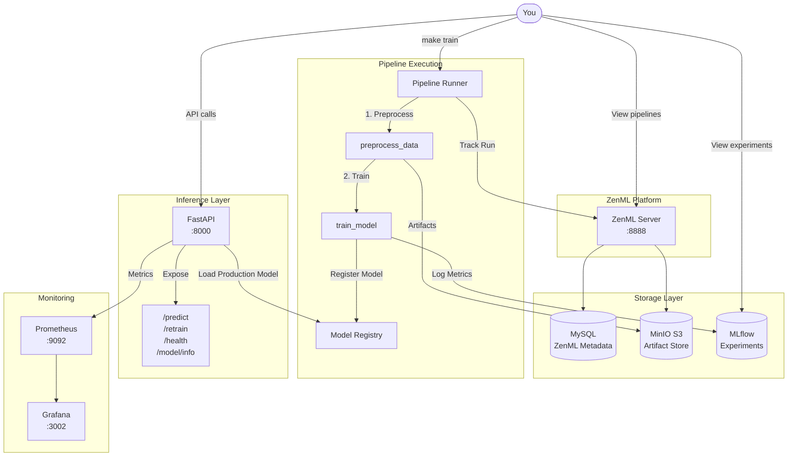
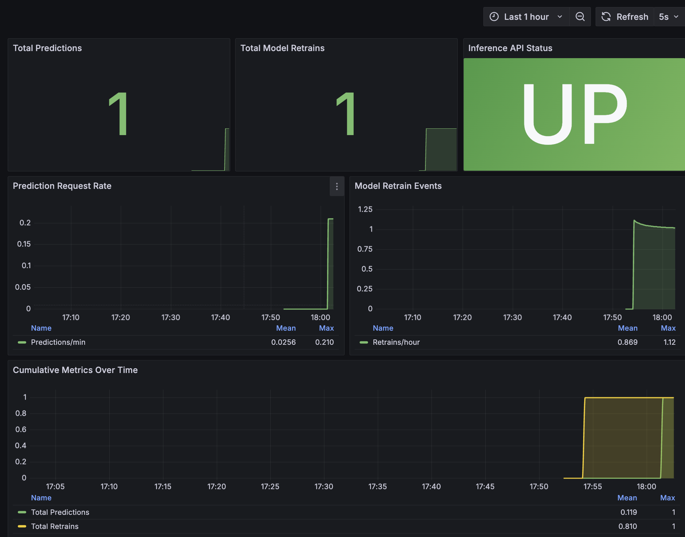

# ZenML MLOps Template

A production-ready MLOps pipeline demonstrating how to build, train, deploy, and monitor ML models using **ZenML**, **MLflow**, **FastAPI**, and **Docker**.


## Table of Contents

1. [Why This Project?](#why-this-project)
2. [Why ZenML Over Airflow/Prefect?](#why-zenml-over-airflowprefect)
3. [Architecture Overview](#architecture-overview)
4. [Quick Start (5 Minutes)](#quick-start-5-minutes)
5. [What Happens Under the Hood](#what-happens-under-the-hood)
6. [Deep Dive: The Pipeline](#deep-dive-the-pipeline)
7. [Deep Dive: Artifact Lineage](#deep-dive-artifact-lineage)
8. [Deep Dive: Model Registry](#deep-dive-model-registry)
9. [Deep Dive: Inference Service](#deep-dive-inference-service)
10. [Monitoring & Observability](#monitoring--observability)
11. [Service URLs & Credentials](#service-urls--credentials)
12. [Commands Reference](#commands-reference)
13. [Project Structure](#project-structure)
14. [Troubleshooting](#troubleshooting)


## Why This Project?

Building ML models is only 20% of the work. The other 80% is:

- **Tracking experiments** - Which hyperparameters produced the best model?
- **Versioning data and models** - Can you reproduce last month's results?
- **Deploying models** - How do you serve predictions at scale?
- **Monitoring** - Is your model still performing well in production?
- **Retraining** - How do you update models when performance degrades?

This template solves all of these challenges with a fully automated, containerized MLOps stack that you can run locally with a single command.


## Why ZenML Over Airflow/Prefect?

You might be wondering: *"Why not just use Airflow or Prefect?"*

Great question. Here's the honest answer:

### Airflow and Prefect are excellent... for general workflows

They're battle-tested, widely adopted, and great for ETL pipelines, data engineering, and general task orchestration. But they weren't designed specifically for ML.

### ZenML is purpose-built for ML pipelines

| Capability | ZenML | Airflow/Prefect |
|---|---|---|
| **Artifact Tracking** | Automatic versioning of DataFrames, models, and any Python object | You build it yourself |
| **Data Lineage** | See exactly which data produced which model | Manual implementation |
| **MLflow Integration** | Native, first-class support | Custom operators needed |
| **Experiment Comparison** | Built into the dashboard | External tools required |
| **Infrastructure Abstraction** | Same code runs locally or on Kubernetes/cloud | Tied to specific infra |
| **Boilerplate** | `@step` and `@pipeline` decorators | Verbose DAG definitions |

### When to use what

**Choose ZenML when:**
- Building ML training and deployment pipelines
- You need artifact versioning and lineage tracking
- Team collaboration on ML experiments
- You want MLflow integration out of the box

**Choose Airflow/Prefect when:**
- Complex ETL without ML components
- You already have significant Airflow/Prefect investment
- Pure data engineering workflows

### The bottom line

ZenML lets you focus on ML, not infrastructure plumbing. This project demonstrates that with a complete, working example.


## Architecture Overview



### Components
| Component | Purpose | Port |
|---|---|---|
| **ZenML Server** | Pipeline orchestration, artifact tracking, metadata storage | 8888 |
| **MinIO** | S3-compatible artifact store (enables dashboard visualization) | 9000, 9001 |
| **MySQL** | ZenML metadata database | 3306 |
| **MLflow** | Experiment tracking and model registry | 5001 |
| **FastAPI** | Model inference service | 8000 |
| **Prometheus** | Metrics collection | 9092 |
| **Grafana** | Metrics visualization | 3002 |


## Quick Start (5 Minutes)

### Demo Video

Watch the full demo of this MLOps template in action:

[](https://us02web.zoom.us/clips/share/q0yjBNlwSLukbmncGEoJ1A)

### Prerequisites

- Docker and Docker Compose
- Make (optional, but recommended)

### Launch Everything

```bash
# Clone the repository
git clone <repo-url>
cd zenml_mlops_template

# Start all services (takes ~30 seconds)
make up

# Run the training pipeline (takes ~20 seconds)
make train

# Make a prediction
make predict
```

That's it. You now have a complete MLOps stack running locally.

### Verify It's Working

1. **ZenML Dashboard**: http://localhost:8888 (admin / zenml)
   - See your pipeline run, artifacts, and lineage

2. **MLflow UI**: http://localhost:5001
   - View experiments, metrics, and registered models

3. **Inference API**: http://localhost:8000/docs
   - Interactive API documentation

4. **Grafana**: http://localhost:3002 (admin / admin)
   - Pre-configured monitoring dashboard


## What Happens Under the Hood

When you run `make train`, here's the complete sequence:

### 1. Service Account Creation (Automatic)

```
Waiting for ZenML server...
Server not activated. Activating with admin account...
Creating service account 'pipeline-runner'...
API key created successfully.
```

The pipeline runner automatically authenticates with ZenML using the REST API. No manual setup required.

### 2. S3 Artifact Store Setup (Automatic)

```
Setting up S3 artifact store (MinIO)...
Registering S3 artifact store...
Registering S3 stack...
Setting s3-stack as active...
```

A MinIO-backed artifact store is registered, enabling full artifact visualization in the dashboard.

### 3. Pipeline Execution

```
Running ZenML pipeline...
Using stack: s3-stack
  orchestrator: default
  artifact_store: s3-artifacts

Step preprocess_data has started.
[preprocess_data] Dataset loaded: 150 samples
[preprocess_data] Train set: 120 samples
[preprocess_data] Test set: 30 samples
Step preprocess_data has finished in 4.7s.

Step train_model has started.
[train_model] Model accuracy: 1.0000
[train_model] ✅ New model (v1) promoted to production!
Step train_model has finished in 7.3s.

Pipeline run has finished in 15.2s.
```


## Deep Dive: The Pipeline

### Pipeline Definition (`run_pipeline.py`)

```python
from zenml import pipeline

@pipeline(name="iris_classification_pipeline")
def iris_pipeline():
    # Artifacts flow automatically between steps
    X_train, X_test, y_train, y_test = preprocess_data()
    train_model(X_train=X_train, X_test=X_test, y_train=y_train, y_test=y_test)
```

That's the entire pipeline definition. ZenML handles:
- Artifact serialization and versioning
- Dependency resolution between steps
- Metadata tracking
- Execution orchestration

### Step 1: Data Preprocessing (`src/pipeline/data_preprocess.py`)

```python
@step(name="preprocess_data")
def preprocess_data() -> Tuple[
    Annotated[pd.DataFrame, "X_train"],
    Annotated[pd.DataFrame, "X_test"],
    Annotated[pd.Series, "y_train"],
    Annotated[pd.Series, "y_test"],
]:
    # Load and split data
    iris = load_iris()
    X_train, X_test, y_train, y_test = train_test_split(...)
    
    # Log metadata (visible in dashboard)
    log_metadata(metadata={
        "dataset_info": {"name": "Iris", "total_samples": 150},
        "split_info": {"train_samples": 120, "test_samples": 30}
    })
    
    return X_train, X_test, y_train, y_test
```

**Key Points:**
- Return type annotations (`Annotated[pd.DataFrame, "X_train"]`) name the artifacts
- `log_metadata()` attaches custom metadata visible in the dashboard
- DataFrames are automatically serialized and versioned

### Step 2: Model Training (`src/pipeline/train_model.py`)

```python
@step(name="train_model")
def train_model(
    X_train: pd.DataFrame,
    X_test: pd.DataFrame,
    y_train: pd.Series,
    y_test: pd.Series,
) -> Annotated[str, "model_uri"]:
    # Train model
    model = RandomForestClassifier(n_estimators=50)
    model.fit(X_train, y_train)
    accuracy = model.score(X_test, y_test)
    
    # Log to MLflow
    with mlflow.start_run():
        mlflow.log_metric("accuracy", accuracy)
        mlflow.sklearn.log_model(model, "model")
    
    # Conditional promotion to production
    if accuracy > production_accuracy:
        # Promote to production
    else:
        # Mark as challenger
    
    # Log metadata
    log_metadata(metadata={
        "model_metrics": {"accuracy": accuracy},
        "mlflow_info": {"run_id": run_id, "promoted": promoted}
    })
    
    return model_uri
```

**Key Points:**
- Receives artifacts from the previous step with full lineage
- Integrates with MLflow for experiment tracking
- Implements conditional model promotion logic
- Logs rich metadata for dashboard visualization


## Deep Dive: Artifact Lineage

One of ZenML's killer features is **automatic artifact lineage tracking**.

### What Gets Tracked

Every artifact (DataFrame, model, etc.) is:
- **Versioned** with a unique ID
- **Stored** in the artifact store (MinIO)
- **Linked** to the step that produced it
- **Connected** to downstream consumers

### Viewing Lineage in the Dashboard

1. Go to http://localhost:8888
2. Navigate to **Pipelines** → **iris_classification_pipeline**
3. Click on a run
4. View the **DAG** to see data flow
5. Click on any artifact to see its metadata and lineage

### Why This Matters

- **Reproducibility**: Know exactly which data produced which model
- **Debugging**: Trace issues back to their source
- **Compliance**: Audit trail for regulated industries
- **Collaboration**: Team members understand data dependencies


## Deep Dive: Model Registry

### The Problem

Without a model registry, you end up with:
- `model_v1_final.pkl`
- `model_v1_final_FINAL.pkl`
- `model_v1_final_FINAL_actually_final.pkl`

### The Solution: MLflow Model Registry

This project uses MLflow's Model Registry with a **production/challenger** pattern:

| Alias | Purpose |
|-||
| `production` | The model currently serving predictions |
| `challenger` | New models that didn't beat production |

### Promotion Logic

```python
if new_accuracy > production_accuracy:
    # Promote to production
    client.set_registered_model_alias(MODEL_NAME, "production", version)
    print(f"✅ New model (v{version}) promoted to production!")
else:
    # Mark as challenger
    client.set_registered_model_alias(MODEL_NAME, "challenger", version)
    print(f"❌ New model (v{version}) NOT promoted. Keeping current production.")
```

### Viewing the Registry

- **MLflow UI**: http://localhost:5001/#/models
- **API Endpoint**: `curl http://localhost:8000/model/info`


## Deep Dive: Inference Service

### FastAPI Endpoints

| Endpoint | Method | Purpose |
|----------|--------|---------|
| `/health` | GET | Health check with model info |
| `/predict` | POST | Make predictions |
| `/retrain` | POST | Trigger model retraining |
| `/model/info` | GET | Detailed production model info |
| `/metrics` | GET | Prometheus metrics |

### Making Predictions

```bash
curl -X POST http://localhost:8000/predict \
  -H "Content-Type: application/json" \
  -d '{"sepal_length": 5.1, "sepal_width": 3.5, "petal_length": 1.4, "petal_width": 0.2}'

# Response: {"prediction": 0}
```

### Triggering Retraining

```bash
curl -X POST http://localhost:8000/retrain

# Response: {"status": "retraining_started", "message": "..."}
```

This triggers the full pipeline in the background:
1. Preprocess data
2. Train new model
3. Compare with production
4. Promote if better

### Model Loading

The inference service loads the **production** model from MLflow:

```python
model = mlflow.sklearn.load_model(f"models:/{MODEL_NAME}@production")
```

When a new model is promoted, the service automatically picks it up on the next request.


## Monitoring & Observability

### Prometheus Metrics

The inference service exposes:
- `prediction_requests_total` - Total predictions made
- `model_retrain_total` - Total retrain triggers

### Grafana Dashboard

A pre-configured dashboard is available at http://localhost:3002/d/mlops-inference



**Panels:**
- Total Predictions counter
- Total Model Retrains counter
- API Status indicator
- Request Rate graph
- Retrain Events timeline

### ZenML Dashboard

http://localhost:8888 provides:
- Pipeline run history
- Step-level logs and metadata
- Artifact lineage visualization
- Stack configuration

### MLflow UI

http://localhost:5001 provides:
- Experiment tracking
- Metric comparison
- Model registry
- Artifact browser


## Service URLs & Credentials

| Service | URL | Credentials |
||--|-|
| ZenML Dashboard | http://localhost:8888 | admin / zenml |
| MinIO Console | http://localhost:9001 | minioadmin / minioadmin |
| MLflow UI | http://localhost:5001 | - |
| Inference API | http://localhost:8000 | - |
| API Docs | http://localhost:8000/docs | - |
| Prometheus | http://localhost:9092 | - |
| Grafana | http://localhost:3002 | admin / admin |


## Commands Reference

### Essential Commands

```bash
make up        # Start all services
make train     # Run training pipeline
make predict   # Make example prediction
make down      # Stop all services
make clean     # Remove everything (including data)
```

### ZenML CLI (via Docker)

```bash
make zenml CMD="pipeline list"       # List pipelines
make zenml CMD="pipeline runs list"  # List runs
make zenml CMD="artifact list"       # List artifacts
make zenml CMD="stack describe"      # Show current stack
```

### Docker Compose

```bash
docker compose up -d                                    # Start services
docker compose --profile pipeline run --rm pipeline-runner  # Run pipeline
docker compose logs -f zenml                            # View ZenML logs
docker compose down -v                                  # Stop and remove volumes
```


## Project Structure

```
zenml_mlops_template/
├── config/
│   ├── prometheus.yml                 # Prometheus scrape config
│   └── grafana/                       # Grafana provisioning
│       ├── provisioning/
│       │   ├── datasources/           # Auto-configured Prometheus
│       │   └── dashboards/            # Dashboard provisioning
│       └── dashboards/
│           └── mlops-dashboard.json   # Pre-built dashboard
├── dockerfiles/
│   ├── Dockerfile.inference           # FastAPI service
│   ├── Dockerfile.pipeline-runner     # ZenML pipeline executor
│   └── requirements-*.txt             # Pinned dependencies
├── scripts/
│   ├── run_zenml_pipeline.sh          # Pipeline entrypoint (handles auth)
│   └── zenml_cli.sh                   # CLI wrapper with auth
├── src/
│   ├── pipeline/
│   │   ├── data_preprocess.py         # Step 1: Data preprocessing
│   │   └── train_model.py             # Step 2: Model training
│   └── services/
│       └── inference/
│           └── inference_service.py   # FastAPI inference service
├── docker-compose.yml                 # Service definitions
├── Makefile                           # Command shortcuts
├── run_pipeline.py                    # ZenML pipeline definition
└── pyproject.toml                     # Python dependencies
```


## Troubleshooting

### Services won't start

```bash
# Check what's running
docker compose ps

# View logs
docker compose logs zenml
docker compose logs mlflow

# Full reset
make clean
make up
```

### Pipeline fails

```bash
# Check pipeline-runner logs
docker compose --profile pipeline logs pipeline-runner

# Verify ZenML server is healthy
curl http://localhost:8888/health
```

### Can't see artifacts in dashboard

Make sure you're using the S3 stack (MinIO). The local artifact store doesn't support dashboard visualization.

```bash
# Check current stack
make zenml CMD="stack describe"

# Should show: artifact_store: s3-artifacts
```

### Model not loading in inference service

```bash
# Check if model is registered
curl http://localhost:8000/model/info

# Check MLflow registry
open http://localhost:5001/#/models
```


## What's Next?

This template is a starting point. Here are some ways to extend it:

1. **Add more steps** - Feature engineering, data validation, model evaluation
2. **Use a different model** - Swap RandomForest for XGBoost, neural networks, etc.
3. **Deploy to cloud** - ZenML supports AWS, GCP, Azure with minimal code changes
4. **Add CI/CD** - Trigger pipelines from GitHub Actions
5. **Implement A/B testing** - Route traffic between production and challenger models


## Moving Forward with ZenML

ZenML offers additional features that you might consider as your ML platform matures:

### Model Control Plane

ZenML's [Model Control Plane](https://docs.zenml.io/concepts/models) provides a unified way to manage ML models across pipelines:

```python
from zenml import pipeline, Model

@pipeline(
    model=Model(
        name="iris_classifier",
        description="Iris flower classification model",
        tags=["classification", "sklearn"]
    )
)
def iris_pipeline():
    # Pipeline steps...
```

**When to consider it:**
- Multiple pipelines for the same ML use case (training, evaluation, deployment)
- Need unified model versioning in ZenML dashboard
- Team collaboration on model development

**Current approach:** This template uses MLflow Model Registry directly, which provides similar functionality with production/challenger aliases.

### MLflow Stack Integration

ZenML can manage MLflow as a [stack component](https://docs.zenml.io/stack-components/model-registries/mlflow):

```bash
zenml integration install mlflow
zenml experiment-tracker register mlflow_tracker --flavor=mlflow
zenml model-registry register mlflow_registry --flavor=mlflow
```

**When to consider it:**
- Consistent MLflow configuration across environments
- MLflow experiments visible in ZenML's unified view
- Automatic tracking without explicit MLflow calls

**Current approach:** Direct MLflow integration in code - simpler and more explicit.

### Pipeline Deployments

ZenML can [deploy pipelines as HTTP services](https://docs.zenml.io/concepts/deployment):

```bash
zenml pipeline deploy my_module.my_pipeline --name my_deployment
```

**When to consider it:**
- Deploy to cloud platforms (AWS App Runner, GCP Cloud Run)
- Automatic scaling and container management
- Inference logic tightly coupled to pipeline

**Current approach:** Custom FastAPI service - more flexible, with Prometheus metrics, custom endpoints, and full control.

### Why We Chose the Current Architecture

| Feature | ZenML Native | Our Approach | Why |
|---------|--------------|--------------|-----|
| Model Registry | Model Control Plane | MLflow Registry | Production/challenger pattern, mature tooling |
| Experiment Tracking | MLflow Stack Component | Direct MLflow | Simpler, explicit control |
| Inference Service | Pipeline Deployments | Custom FastAPI | Prometheus metrics, custom endpoints, flexibility |
| Artifact Store | Local/Cloud | MinIO (S3) | Dashboard visualization, cloud-ready |

This architecture balances **simplicity** with **production-readiness**. As your needs grow, ZenML's additional features are there when you need them.


*Built with ZenML, MLflow, FastAPI, and Docker*
