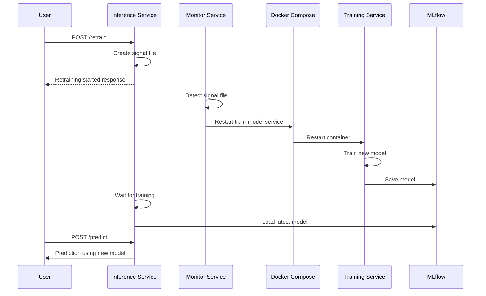

# End-to-End MLOps Template with ZenML and Docker

This project provides a complete MLOps template using ZenML and Docker. It demonstrates a full machine learning lifecycle with automated training, serving, monitoring, and retraining capabilities.

## Architecture Overview


### Components

1. **Data Pipeline**
   - **Data Preprocessing**: Loads and preprocesses the Iris dataset
   - **Model Training**: Trains a RandomForest model and logs to MLflow
   - **MLflow**: Tracks experiments, metrics, and stores models

2. **Inference Service**
   - **FastAPI Service**: Provides REST API endpoints
   - **Model Loading**: Loads the latest model from MLflow
   - **Prediction Endpoint**: Serves model predictions
   - **Retraining Endpoint**: Triggers model retraining

3. **Monitoring**
   - **Prometheus**: Collects metrics from the inference service
   - **Grafana**: Visualizes metrics and creates dashboards
   - **Monitor Service**: Watches for retraining signals
   - **Docker Compose**: Orchestrates service restarts for retraining

### Retraining Flow



## Project Structure

```
zenml_mlops_template/
├── config/                    # Configuration files
│   └── prometheus.yml         # Prometheus monitoring configuration
├── data-file/                 # Data directory
│   └── iris_preprocessed.csv  # Preprocessed data
├── dockerfiles/               # Dockerfiles for each service
│   ├── Dockerfile.inference   # Dockerfile for the inference service
│   ├── Dockerfile.monitor     # Dockerfile for the retraining monitor
│   ├── Dockerfile.preprocess  # Dockerfile for data preprocessing
│   └── Dockerfile.train       # Dockerfile for model training
├── src/                       # Source code
│   ├── pipeline/              # Pipeline components
│   │   ├── __init__.py
│   │   ├── data_preprocess.py # Data preprocessing script
│   │   ├── pipeline.py        # Pipeline definition
│   │   └── train_model.py     # Model training script
│   └── services/              # Service components
│       ├── __init__.py
│       ├── inference/         # Inference service
│       │   ├── __init__.py
│       │   └── inference_service.py # FastAPI inference service
│       └── monitor/           # Monitor service
│           ├── __init__.py
│           ├── monitor_service.py # Retraining monitor service
│           └── run_monitor.py # Entry point for monitor service
├── docker-compose.yml         # Docker Compose configuration
├── run_pipeline.py            # ZenML pipeline runner
├── setup_zenml_api_key.py     # Script to set up ZenML API key authentication
└── README.md                  # This file
```

## Prerequisites

- Docker and Docker Compose installed
- Python 3.8+ installed
- Basic understanding of machine learning concepts

## Getting Started: Step-by-Step Guide

### 1. Clone the Repository

```bash
git clone https://github.com/yourusername/zenml_mlops_template.git
cd zenml_mlops_template
```

### 2. Set Up ZenML API Key Authentication

The template uses ZenML API key authentication for secure, non-interactive access to the ZenML server. This is the recommended approach for containerized environments in ZenML 0.75.0.

Run the provided setup script to create a service account and generate an API key:

```bash
python setup_zenml_api_key.py
```

This script will:
- Start the ZenML server if it's not already running
- Connect to the ZenML server
- Create a service account named "training-service"
- Generate an API key for this service account
- Save the API key to a `.env` file for use with docker-compose

### 3. Start the Services

Once the API key is set up, start all the services:

```bash
docker-compose up -d
```

This command will:
- Start the ZenML server with MySQL as the metadata store
- Start the MLflow tracking server
- Start the training service that runs the ZenML pipeline
- Start the inference service for serving predictions
- Start the monitor service for automated retraining
- Start Prometheus and Grafana for monitoring

Check that all services are running:

```bash
docker-compose ps
```

### 4. Verify the Pipeline Execution

Check the logs of the train-model service to verify that the pipeline is running correctly:

```bash
docker-compose logs train-model
```

You should see output indicating that:
- The service connected to the ZenML server using API key authentication
- The pipeline steps (data preprocessing and model training) executed successfully
- The model was saved to MLflow

### 5. Access the Services

| Service | URL | Description |
|---------|-----|-------------|
| Inference API | http://localhost:8000 | FastAPI service for predictions |
| MLflow | http://localhost:5000 | MLflow UI for experiment tracking |
| ZenML | http://localhost:8080 | ZenML Dashboard |
| Prometheus | http://localhost:9090 | Prometheus UI for metrics |
| Grafana | http://localhost:3000 | Grafana for visualization |

### 6. Test the Inference Service

Check the health of the inference service:

```bash
curl http://localhost:8000/health
```

Make a prediction:

```bash
curl -X POST -H "Content-Type: application/json" -d '{"sepal_length": 5.1, "sepal_width": 3.5, "petal_length": 1.4, "petal_width": 0.2}' http://localhost:8000/predict
```

### 7. Trigger Model Retraining

Trigger model retraining via the API:

```bash
curl -X POST http://localhost:8000/retrain
```

This will:
1. Create a signal file in the data-file directory
2. The monitor service will detect this file and restart the train-model service
3. The train-model service will retrain the model and save it to MLflow
4. The inference service will load the new model for future predictions

## How It Works: Detailed Explanation

### ZenML Authentication

The template uses ZenML API key authentication for secure, non-interactive access to the ZenML server. Here's how it works:

1. The `setup_zenml_api_key.py` script creates a service account and generates an API key
2. The API key is saved to a `.env` file and loaded by Docker Compose
3. The `docker-compose.yml` file passes the API key to the training service as an environment variable
4. The `run_pipeline.py` script uses this API key to authenticate with the ZenML server

The authentication flow in `run_pipeline.py`:
- Gets the API key from the environment variables
- Sets up the ZenML client with the API key
- Connects to the ZenML server and activates the appropriate stack
- Runs the pipeline using the authenticated client

### Pipeline Execution

The pipeline is defined in `src/pipeline/pipeline.py` and executed in `run_pipeline.py`. It consists of two main steps:

1. **Data Preprocessing**: Loads the Iris dataset, preprocesses it, and saves it to a CSV file
2. **Model Training**: Loads the preprocessed data, trains a RandomForest model, and logs it to MLflow

The pipeline is executed using ZenML's pipeline decorator, which handles the orchestration and tracking of the steps.

### Inference Service

The inference service is a FastAPI application that:
- Loads the latest model from MLflow on startup
- Provides a `/predict` endpoint for making predictions
- Provides a `/retrain` endpoint for triggering model retraining
- Provides a `/health` endpoint for checking the service status

### Monitor Service

The monitor service is a Python script that:
- Watches for a signal file in the data-file directory
- When the signal file is detected, it restarts the train-model service using Docker Compose
- This triggers a new pipeline run, which retrains the model and saves it to MLflow

### Retraining Flow

The retraining flow is designed to be non-intrusive and follows a clean separation of concerns:

1. The user or an automated system triggers retraining via the `/retrain` endpoint
2. The inference service creates a signal file
3. The monitor service detects the signal file and restarts the train-model service
4. The train-model service retrains the model and saves it to MLflow
5. The inference service loads the new model for future predictions

This approach avoids direct Docker CLI access from the inference container and provides a clean separation of concerns between services.

## Troubleshooting

### ZenML Authentication Issues

If you encounter authentication issues with ZenML:

1. Check that the ZenML server is running:
   ```bash
   docker-compose ps zenml
   ```

2. Verify the API key in the `.env` file:
   ```bash
   cat .env
   ```

3. Check the environment variables in the train-model container:
   ```bash
   docker exec -it zenml_mlops_template-train-model-1 env | grep ZENML
   ```

4. Check the train-model service logs:
   ```bash
   docker-compose logs train-model
   ```

### Pipeline Execution Issues

If the pipeline fails to execute:

1. Check the train-model service logs:
   ```bash
   docker-compose logs train-model
   ```

2. Verify that the MLflow server is running:
   ```bash
   docker-compose ps mlflow
   ```

3. Check the MLflow server logs:
   ```bash
   docker-compose logs mlflow
   ```

### Inference Service Issues

If the inference service fails to start or make predictions:

1. Check the inference service logs:
   ```bash
   docker-compose logs inference
   ```

2. Verify that the model is available in MLflow:
   ```bash
   curl http://localhost:5000/api/2.0/mlflow/experiments/list
   ```

## Resources

- [ZenML Documentation](https://docs.zenml.io/)
- [ZenML Authentication Guide](https://docs.zenml.io/how-to/project-setup-and-management/connecting-to-zenml/connect-with-a-service-account)
- [MLflow Documentation](https://mlflow.org/docs/latest/index.html)
- [FastAPI Documentation](https://fastapi.tiangolo.com/)
- [Docker Compose Documentation](https://docs.docker.com/compose/)
